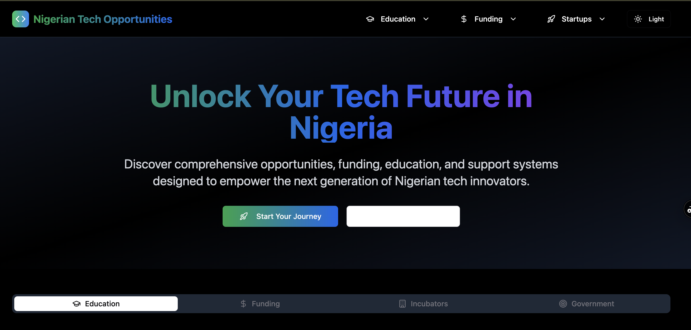

# 🇳🇬 Nigerian Tech Opportunities

## 🌐 Live Demo
**[🚀 Visit Nigerian Tech Opportunities](https://nigerian-tech-opportunities.vercel.app/)**



## 📋 Overview

**Nigerian Tech Opportunities** is a comprehensive platform designed to empower the next generation of Nigerian tech innovators. Discover opportunities, funding, education, and support systems that will unlock your tech future in Nigeria's rapidly growing digital economy.

## ✨ Features

### 🎓 **Educational Programs & Coding Bootcamps**
- Premium tech training programs
- Coding bootcamps with job placement
- Remote internship opportunities
- World-class tech education designed for Nigerian youth

### 💰 **Funding & Scholarships**
- Access to financial support for tech careers
- Startup funding opportunities
- Scholarships for tech education
- Entrepreneurial journey support

### 🏢 **Startup Incubators & Accelerators**
- Nigeria's thriving startup ecosystem
- World-class incubation programs
- Accelerator opportunities
- Networking with industry leaders

### 🏛️ **Government Initiatives**
- Government-backed tech programs
- Digital economy initiatives
- Policy support for tech innovation
- Public-private partnerships

## 🎨 Design Features

- 🌙 **Dark/Light Mode Support** - Seamless theme switching
- 📱 **Responsive Design** - Perfect on all devices
- ⚡ **Fast Performance** - Built with Vite for optimal speed
- 🎯 **User-Friendly Interface** - Intuitive navigation and design
- 🔗 **External Links** - Direct access to opportunities and communities

## 🛠️ Tech Stack

- **Frontend**: React 18 + TypeScript
- **Build Tool**: Vite
- **Styling**: Tailwind CSS
- **UI Components**: Radix UI
- **Icons**: Lucide React
- **Deployment**: Vercel

## 🚀 Getting Started

### Prerequisites
- Node.js (v18 or higher)
- npm or yarn

### Installation

1. **Clone the repository**
   ```bash
   git clone https://github.com/raimonvibe/nigerian-tech-opportunities.git
   cd nigerian-tech-opportunities
   ```

2. **Install dependencies**
   ```bash
   npm install
   ```

3. **Start development server**
   ```bash
   npm run dev
   ```

4. **Open your browser**
   ```
   http://localhost:5173
   ```

### Build for Production

```bash
npm run build
```

### Preview Production Build

```bash
npm run preview
```

## 📁 Project Structure

```
nigerian-tech-opportunities/
├── src/
│   ├── components/          # Reusable UI components
│   ├── lib/                 # Utility functions
│   ├── App.tsx             # Main application component
│   └── main.tsx            # Application entry point
├── public/                 # Static assets
├── tech.png               # Project screenshot
└── README.md              # Project documentation
```

## 🌟 Key Highlights

- **🎯 Comprehensive Resource Hub**: All-in-one platform for Nigerian tech opportunities
- **🔗 Community Integration**: Direct links to WhatsApp tech communities
- **📊 Categorized Content**: Organized by Education, Funding, Incubators, and Government initiatives
- **💡 Real Opportunities**: Curated list of actual programs and initiatives
- **🌍 Remote-First**: Focus on remote opportunities and global connections

## 🤝 Contributing

We welcome contributions to improve Nigerian Tech Opportunities! Here's how you can help:

1. **Fork the repository**
2. **Create a feature branch** (`git checkout -b feature/amazing-feature`)
3. **Commit your changes** (`git commit -m 'Add amazing feature'`)
4. **Push to the branch** (`git push origin feature/amazing-feature`)
5. **Open a Pull Request**

## 📞 Community & Support

- 💬 **WhatsApp Community**: [Join our tech community](https://chat.whatsapp.com/HESiDNIIjwrKWMnvGnzp3y?mode=r_c)
- 🌐 **Remote Opportunities**: [Explore on Wellfound](https://wellfound.com/jobs)
- 📧 **Contact**: For questions and support

## 📄 License

This project is open source and available under the [MIT License](LICENSE).

## 🙏 Acknowledgments

- Nigerian tech community for inspiration and feedback
- All the organizations and initiatives featured on the platform
- Contributors who help improve the platform

---

**🚀 Ready to unlock your tech future in Nigeria? [Get started now!](https://nigerian-tech-opportunities.vercel.app/)**
